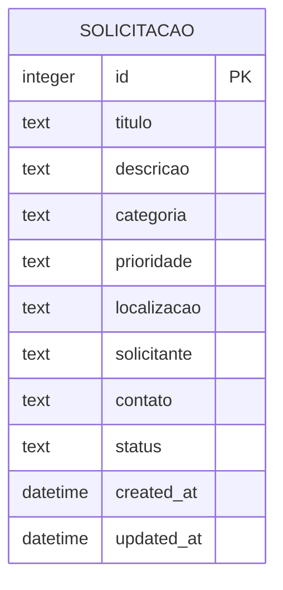
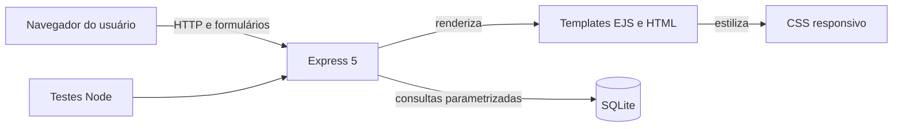

# Requisitos e modelagem

## 1. Premissas de levantamento

Este documento registra requisitos iniciais derivados do problema proposto e da análise técnica. Eles devem ser revisados depois das entrevistas com a organização parceira. Nenhuma persona ou necessidade abaixo substitui evidência de campo.

## 2. Histórias de usuário

- Como participante da comunidade, quero registrar uma necessidade com local e descrição para que ela não se perca em conversas.
- Como participante, quero pesquisar e filtrar registros para saber se uma demanda já foi comunicada.
- Como representante da organização, quero alterar o status para tornar o andamento visível.
- Como representante, quero corrigir informações incompletas para manter o histórico útil.
- Como equipe, quero consultar indicadores para entender volume e distribuição das demandas.

## 3. Requisitos funcionais

| ID | Requisito | Prioridade | Critério de aceite |
|---|---|---|---|
| RF01 | cadastrar solicitação | essencial | registro válido é persistido e recebe identificador |
| RF02 | listar solicitações | essencial | mural exibe registros do banco |
| RF03 | visualizar detalhes | essencial | página mostra título, descrição, local, categoria, prioridade e status |
| RF04 | editar solicitação | essencial | alterações válidas são persistidas |
| RF05 | excluir solicitação | desejável | confirmação precede exclusão e item deixa de aparecer |
| RF06 | atualizar status | essencial | status aceita somente os três valores definidos |
| RF07 | buscar por texto | desejável | título, descrição e localização são pesquisáveis |
| RF08 | filtrar registros | desejável | filtros de categoria e status podem ser combinados |
| RF09 | exibir indicadores | desejável | totais refletem o conteúdo atual do banco |
| RF10 | validar formulário | essencial | dados ausentes ou fora dos limites retornam orientação |

## 4. Requisitos não funcionais

| ID | Requisito | Forma de verificação |
|---|---|---|
| RNF01 | aplicação web responsiva entre 320 px e desktop | inspeção nas larguras-alvo |
| RNF02 | interface operável por teclado | navegação por Tab e foco visível |
| RNF03 | páginas com HTML semântico e idioma pt-BR | inspeção do HTML renderizado |
| RNF04 | consultas parametrizadas | revisão do módulo de banco |
| RNF05 | dados persistidos após reinício | teste automatizado com arquivo SQLite fechado e reaberto; ensaio do ambiente real continua pendente |
| RNF06 | fluxo crítico coberto por testes automatizados | execução de `npm test` |
| RNF07 | execução local documentada | repetição dos passos do README |
| RNF08 | dados pessoais não obrigatórios | inspeção do formulário e do esquema |

## 5. Regras de negócio

1. título deve ter entre 5 e 100 caracteres;
2. descrição deve ter entre 10 e 1.000 caracteres;
3. cada solicitação possui uma categoria e uma prioridade válidas;
4. localização e nome do solicitante são obrigatórios;
5. contato é opcional e limitado a 120 caracteres;
6. toda solicitação inicia como `Aberta`;
7. status permitido: `Aberta`, `Em andamento` ou `Concluída`;
8. data de atualização muda quando conteúdo ou status é alterado.

## 6. Fluxos críticos

### Cadastro

1. usuário abre “Nova solicitação”;
2. informa título, descrição, categoria, prioridade, local e nome;
3. servidor normaliza e valida os dados;
4. em caso de erro, o formulário retorna com mensagens;
5. em caso de sucesso, o banco grava o registro e o sistema abre os detalhes.

### Acompanhamento

1. usuário consulta o mural;
2. combina busca e filtros, se necessário;
3. abre um registro;
4. consulta situação, descrição e datas;
5. representante pode atualizar o status.

## 7. Modelo de dados

O MVP usa uma entidade porque o objetivo do PI I é validar o fluxo central. Autenticação futura exigirá, no mínimo, entidades de usuário, organização e histórico de status.

## 8. Arquitetura

## 9. Matriz de rastreabilidade

| Objetivo específico | Requisitos | Evidência técnica |
|---|---|---|
| modelar dados | RF01, RF03, RNF05 | esquema `solicitacoes` |
| organizar demandas | RF02, RF07, RF08 | mural e filtros |
| acompanhar atendimento | RF06, RF09 | status e painel |
| assegurar consistência | RF10, RNF04, RNF06 | validação, parâmetros e testes |
| tornar o produto acessível | RNF01, RNF02, RNF03 | CSS responsivo, foco e semântica |

## 10. Limites para implantação

O MVP não deve ser publicado para uso aberto sem autenticação, autorização, proteção contra abuso, política de privacidade, definição de responsáveis e adequação ao contexto da organização. A etapa de campo deve usar dados fictícios ou consentidos.

